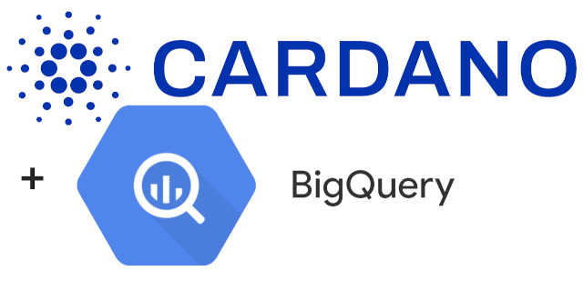

# Cardano on-chain data on BigQuery

Access the [project on BigQuery](https://console.cloud.google.com/bigquery?project=iog-data-analytics&supportedpurview=project&ws=!1m4!1m3!3m2!1siog-data-analytics!2scardano_mainnet)

This repository keeps the scripts and schema defitions of this project and ensures good communication with the great Cardano community.

Send in your [PRs](https://github.com/input-output-hk/data-analytics-bigquery/pulls/) or open an [issue](https://github.com/input-output-hk/data-analytics-bigquery/issues).

License: [Apache 2.0](./LICENSE)

## Disclaimer

The data is provided as-is without any responsibility for correctness. The project is currently run in beta stage meaning data delivery can be disrupted at any moment and data can even be incomplete or corrupted.

## Documentation

We document this project in the [wiki](https://github.com/input-output-hk/data-analytics-bigquery/wiki).

## Contributions

Suggest changes and additions in form of [PRs](https://github.com/input-output-hk/data-analytics-bigquery/pulls) or submit your questions and also feedback as [issues](https://github.com/input-output-hk/data-analytics-bigquery/issues).

In the future, we are looking for collaboration with other groups to share the computational effort for updating the data from _db-sync_.
